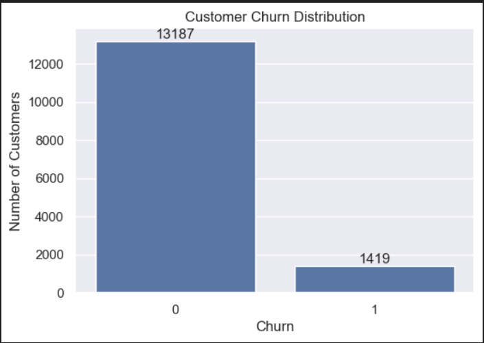
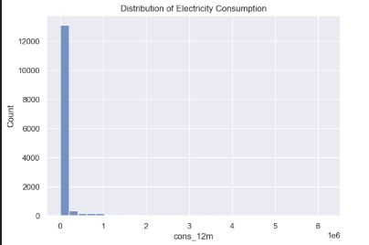
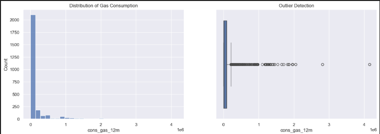

# **Customer-Churn-Perdiction-with-Price-Sensitivity-Insights**

## **Business Overview**

In the energy and utilities industry, customer churn is a high-cost problem due to:

- High acquisition costs per customer
- Long contract cycles
- Thin profit margins
- Increasing competition in deregulated markets

*Even a small increase in churn can lead to millions in revenue loss annually.*

## **Problem Statement**

The company is facing unexpected customer churn, but lacks clarity on:

- What type of customers are leaving
- Whether pricing impacts churn decisions
- How consumption behavior relates to churn
- Which customers are at risk before they leave

*This project aims to bridge that gap using data.*

## **Project Roadmap**

| Stage                   | Description                        | 
| ----------------------- | ---------------------------------- | 
| EDA & Visualisation      | Data understanding & visualization | 
| Feature Engineering | Feature creation & transformation  | 
| Modeling             | ML model building                  | 
| Evaluation           | Model performance & insights       |

### Tech Stack

*Python, Pandas, NumPy, Matplotlib, Seaborn, Jupyter Notebook*

## **Dataset**

| Dataset           | Description                            |
| ----------------- | -------------------------------------- |
| `client_data.csv` | Customer consumption, forecasts, churn |
| `price_data.csv`  | Time-based electricity pricing         |

## **Exploratory Data Analysis & Data Visualisation**

**1️. Churn Distribution (Class Imbalance)**

- Around 90% customers retained
- Around 10% customers churned

  

  <em>Figure 1: Churn Distribution</em>

*Insight: Severe imbalance → model must handle bias toward majority class*
*Churn is rare but business-critical*

**2️. Consumption Distribution**

- Highly right-skewed
- Few customers consume significantly more energy

  
  

  <em>Figure 2: Consumption Dsitribution</em>

*Insight: Indicates distinct customer segments (residential vs industrial)*
*Consumption varies drastically across customers*

**3️. Outlier Detection**

- Aroun 14% outliers identified

*Insight: Outliers represent high-value customers, not noise. So  it should NOT be blindly removed*

**. Churn vs Consumption Behavior**

- Churned customers show different usage trends

*Insight:Consumption behavior can act as an early churn signal*
*Behavioral patterns differ between churned vs retained users*

**5️. Price Sensitivity Analysis**

*Insight: Pricing likely plays a role in churn decisions*
*Customers might react to peak/off-peak differences*

## **Business Impact**

This analysis enables:

- Targeted retention campaigns
- Protection of high-value customers
- Better customer segmentation
- Strong foundation for predictive churn models

## **Feature Engineering** 
This file contains a Jupyter Notebook focused on feature engineering for a customer churn and price sensitivity project.

What it does:

1. Data Loading – Reads client and price datasets using pandas.
2. Feature Creation – Builds new variables such as:
2.1 Monthly and yearly price changes.
2.2 Off-peak vs. peak price differences (e.g., December vs. January).
2.3 Date-derived fields like year, month, and season.
3. Data Cleaning – Handles missing values and formats data for analysis.
4. Visualization – Uses matplotlib and seaborn to check feature distributions and relationships.

These engineered features are intended to be inputs for churn prediction models, helping test whether price sensitivity is a major factor in customer churn.
 
## **Model Training and Evaluation**
This file contains a Jupyter Notebook for building and evaluating a machine learning classification model.

The workflow includes:

1. Model Training – Trains classification models with scikit-learn Random Forest and XGBoost.
2. Evaluation – Uses metrics such as confusion matrix, accuracy, precision to assess performance.

The notebook is intended as a complete reference for preprocessing, model building, and evaluation in a predictive analytics project.

## Hybrid Observations – Random Forest vs. XGBoost

1. Consumption & Net Margin Dominate

*Random Forest*: cons_12m, net_margin, and margin_net_pow_ele are the strongest churn indicators, pointing to profitability and annual consumption as key drivers.

*XGBoost*: Confirms the same dominance but with slightly higher weight given to combined effects of consumption and margin. XGBoost detects more nuanced thresholds where consumption changes cause churn.

Interpretation:
Extreme consumption (very high or low) and profitability margins correlate with dissatisfaction or higher operational costs, leading to churn.

2. Contract Behavior & Timing Are Crucial

*Random Forest*: months_active, months_modif_prod, months_renewal, and tenure show strong influence, signaling loyalty and commitment patterns.

*XGBoost*: Places equal emphasis but also identifies interaction effects (e.g., how tenure combined with consumption impacts churn probability).

Interpretation:
Time-based behavioral patterns — engagement, contract modifications, renewal proximity — heavily influence churn likelihood.

3. Feature Engineering Validated

*Random Forest*: Engineered price-difference and peak usage variants outperform their raw counterparts but rank mid-tier.

*XGBoost*: Gives slightly higher importance to engineered interaction features, proving boosted trees leverage derived metrics more effectively.

Interpretation:
Thoughtful feature engineering improves prediction quality for both models, especially for non-linear models like XGBoost.

4. Price Sensitivity = Weak Contributor

*Random Forest*: Price-related features rank in the lower-middle, playing a supporting role.

*XGBoost*: Same trend, but with better integration into interaction effects (e.g., price × contract length).

Interpretation:
Price changes alone do not drive churn — they matter more when combined with other stressors like low margins or long tenure.

## Hybrid Conclusion

*Both models pinpoint Consumption, Profitability Margins, and Contract Timing as the dominant churn predictors, with Price Sensitivity playing a secondary role.*

## **Directions to run the code**

1. Unzip the whole repository and make it your current directory 
2. Install all the required dependencies using the pip install -r requirements.txt
3. Run the file in the following order:

                   imports → Exploratory Data Analysis & Visualisation → Feature Engineering
                              Post EDA → Model Training & Prediction → Evaluation

The notebook will:
Load and preprocess the dataset.
Perform data visualization and exploratory analysis.
Train machine learning models.
Output performance metrics and graphs.

## **Project Structure**

## **Author**
**Hanan**
*Data Science | Machine Learning | Analytics*
